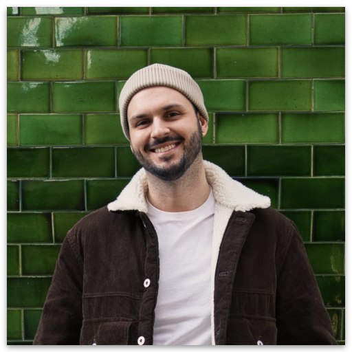

<div align="center">
  
  <h1>social-links-page</h1>
  <p>A personal links page built with Astro.</p>
</div>

## What's inside

The page shows a profile photo, a name, and a list of social links: Bluesky, GitHub, Instagram, LinkedIn, Mastodon, Threads, and Buy Me A Coffee. Each link is a button with a Font Awesome brand icon that shakes on hover.

It is a single static page. The tech stack:

- [Astro 7](https://astro.build/) with file-based routing and static output
- [Tailwind CSS 4](https://tailwindcss.com/) with shadcn-style theme variables
- Font Awesome kit for brand icons; [lucide](https://lucide.dev/) for footer icons
- Profile image optimized by `astro:assets` (`sharp`)
- DM Sans from Google Fonts

## Getting started

Requirements: Node `>=24.15.0` and [pnpm](https://pnpm.io/).

```bash
pnpm install
```

| Command        | Description                        |
| -------------- | ---------------------------------- |
| `pnpm dev`     | Start the dev server on port 4321  |
| `pnpm build`   | Production build to `dist/`        |
| `pnpm preview` | Preview the production build       |

> [!NOTE]
> `.npmrc` sets `shamefully-hoist=true`, which Astro requires for pnpm installs. Do not remove it, and use pnpm rather than npm or yarn.

> [!IMPORTANT]
> `sharp` is a direct dependency on purpose. Astro declares it as an optional peer, so pnpm never auto-installs it, and fresh installs would fail image generation without it.

## Project structure

```text
src/
├── components/   # Link, Links, Header, Footer
├── images/       # Images optimized by Astro
├── layouts/      # Layout wrapper
├── lib/          # cn() and buttonVariants helpers
├── pages/        # Routes
└── styles/       # globals.css: Tailwind + shadcn theme variables
public/           # Static assets (favicons)
```

## Docker

The `Dockerfile` runs a multi-stage build: pnpm install and `pnpm build` on `node:24-alpine`, then `dist/` is served by Caddy on port 80.

```bash
docker build -t social-links-page .
docker run -p 80:80 social-links-page
```

> [!WARNING]
> `pnpm-workspace.yaml` overrides `@ungap/structured-clone` to `1.3.1` to patch CWE-502. Do not remove this override.
